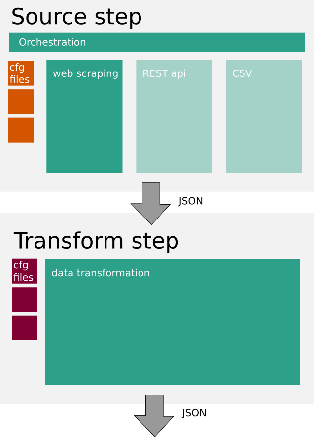

# API-harvester

Apinf.io has a catalog that lists APIs. We need content. The harvester collects API metadata from multiple sources.

**Product Owner:** Jarkko Moilanen (APInf Oy), jarkko(at)apinf.io

# Scope

The harvesting happens in 2 separate steps:
- Source step
- Transform step

## Source step
We collect data in 3 different ways: web scraping, REST api and CSV files.
The output is JSON.
[Source step requirements](docs/source-step/requirements.md) are in separate file.

## Transform step
JSON input is transformed to the appropriate output using the correct datamodel.
[Transform step requirements](docs/transform-step/requirements.md) are in separate file.

## Graphical overview

# Requirements
- No GUI is needed. We work with command line.
- NodeJS is the most appropriate: JSON, mature, easy to deploy
- This project needs to be done modular. This way we can expand easily.
- We should be able to run this with a cron script or just by calling command line.
- Needs to be easily deployed with Docker (Compose).

# Out of scope
- Any other site to be scraped (only programmableweb.com is in scope)
- Conflict resolution
- Ownership
- Deleted APIs
- Scheduling
- Lifecycle
- Performance
- Frontend design
- Legal
